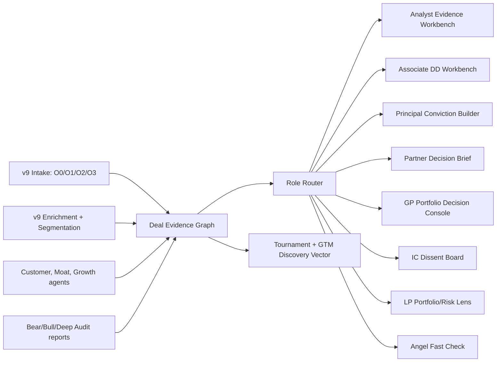

# PRD: Deal Evidence Graph + Role-Native DD Interfaces

## 1. Product thesis

**Главный вывод:** один `Deal Evidence Graph`, много `role-native interfaces`.

Стратегические команды, IC, Boards, investors, entrepreneurs и LP одновременно являются потребителями и валидаторами не до конца проверенных, но структурированных данных. Продукт должен не прятать неопределенность, а превращать ее в управляемый evidence workflow: каждый пользователь видит один и тот же граф сделки, но в интерфейсе, который соответствует его роли, решению и бизнес-модели.

## 2. Product scope

### In scope

- DD-сделки, где был заказан `bear_case`, `bull_case` или `deep_audit`.
- Deal-level evidence graph: claims, evidence, risks, valuation, customer signals, channel economics, management signals, dissent, LP exposure.
- Role-native workbenches для 9 интерфейсов.
- Alignment with BCG-team v9 / Unified MAS pipeline: intake, enrichment, segmentation, customer/moat, growth, options, selection, delivery, GTM monitoring.
- Tournament vector для GTM Discovery: какие сделки и роли лучше всего доказывают willingness-to-pay.

### Out of scope for this local prototype

- Production auth, billing, permissions.
- Live source crawling.
- Full graph database backend.
- Automated LLM agent execution.

## 3. Target users and interfaces

| Role | Interface | Primary product | Primary decision |
|---|---|---|---|
| Analyst | Analyst Evidence Workbench | Channel Economics Report | Can I trust the evidence base? |
| VP/Sr Associate | Associate DD Workbench | Customer Signal Intelligence | What customer signals change the case? |
| Principal | Principal Conviction Builder | Customer Signal Intelligence | What is the conviction path and kill switch? |
| Partner | Partner Decision Brief | Management Team Assessment | What should we recommend to IC/client? |
| GP/MD | GP Portfolio Decision Console | Management Team Assessment | How does this change portfolio risk/return? |
| IC Member | IC Pre-read and Dissent Board | Management Team Assessment | What is the strongest dissent before vote? |
| LP/Family Office | LP Portfolio Lens | Annual Portfolio Monitoring | Which manager/deal risks need monitoring? |
| LP/Institutional | Institutional LP Risk Lens | LP Co-Investment Screening | Is co-investment exposure acceptable? |
| Angel | Angel Fast Check | Customer Signal Intelligence | Is this worth one more diligence cycle? |

## 4. Architecture concept

## 5. Data model

### Core nodes

- `Deal`: company, date, deal type, asking price, product ordered, verdict, score.
- `Claim`: investment hypothesis, bear claim, bull claim, uncertainty, refuted point.
- `Evidence`: source, quote/extract, confidence, provenance, freshness.
- `Risk`: market, product, team, valuation, regulatory, portfolio, timing.
- `CustomerSignal`: buyer pain, retention signal, willingness-to-pay, adoption friction.
- `ChannelEconomics`: CAC, sales motion, margin, distribution dependency.
- `ManagementAssessment`: founder/team pattern, execution capacity, governance.
- `Valuation`: fair value, asking price, gap, downside, upside.
- `Dissent`: counterargument, IC objection, unresolved question, kill criterion.
- `Artifact`: bear case, bull case, deep audit, fast short, decision memo.
- `RoleInterface`: role, interface, primary product, required artifact shape.

### Core edges

- `supports`: evidence supports claim.
- `refutes`: evidence refutes claim.
- `prices`: valuation prices a deal/claim.
- `risks`: risk affects deal or portfolio.
- `routes_to`: graph node routes into a role-native interface.
- `requires_validation`: node needs user/agent validation.
- `escalates_to_gate`: issue escalates to a BCG-team v9 gate.
- `appears_in_artifact`: node appears in report/memo/pre-read.

## 6. BCG-team v9 workflow alignment

| v9 / Unified MAS step | Product execution |
|---|---|
| O0/O1/O2/O3 intake and source collection | Create `Deal`, `Artifact`, `Evidence` nodes; capture ordered product and source provenance. |
| G0/G1 brief and enrichment routing | Normalize company, deal type, valuation, and research depth; determine eligible roles. |
| Market map / segmentation | Attach `Market`, `Segment`, `ChannelEconomics`, and competitor evidence. |
| Customer and moat phases | Create `CustomerSignal`, `Moat`, `ManagementAssessment`, and confidence edges. |
| Growth and future states | Attach growth scenarios, upside/downside, monitoring triggers. |
| Options and selection | Convert graph into decision paths, kill switches, and IC dissent. |
| Delivery phase | Generate role-native workbench outputs and decision briefs. |
| GTM phase | Use tournament vector to identify highest-WTP roles and products. |

## 7. Functional requirements

1. The user can select any role and see the matching interface, primary product, decision job, and required evidence blocks.
2. The user can select DD deals from the tournament vector and see verdict, score, confidence, ordered products, and valuation gap.
3. The UI shows one shared graph and highlights the nodes relevant to the selected role.
4. The pipeline view maps graph nodes to BCG-team v9 phases and gates.
5. The product distinguishes validated, unvalidated, refuted, and watchlist evidence.
6. The interface exposes dissent as a first-class object, not as a hidden appendix.
7. Each role view must preserve provenance and uncertainty.

## 8. Non-functional requirements

- Local-first prototype: runs from static files on localhost.
- No external dependencies required for the prototype.
- Fast enough for IC pre-read workflows: first screen under 1 second on localhost.
- Clear role routing: no role should need to understand the whole system to use its interface.
- Extendable to a graph DB later without changing product concepts.

## 9. Local prototype acceptance criteria

- PRD exists and maps role interfaces to products.
- UI runs on localhost.
- UI includes all 9 requested roles.
- UI uses the DD deal vector as its deal universe.
- UI shows graph, role workbench, pipeline alignment, and test status.
- Smoke test confirms the localhost route serves successfully.

## 10. Test plan

| Test | Expected result |
|---|---|
| Static server response | `index.html` returns HTTP 200. |
| Role router | Each of 9 roles updates interface, product, focus blocks, and graph highlights. |
| Deal selector | Each eligible DD deal updates verdict, score, confidence, product badges, and claims. |
| Pipeline coverage | v9 phases are visible and mapped to graph execution. |
| Evidence state display | Validated, unvalidated, refuted, and watchlist states are visually distinct. |

## 11. GTM Discovery wedge

The strongest initial wedge is **DD evidence products for investors ordering bear/bull/deep audit on ambiguous high-stakes deals**.

Recommended sequencing:

1. Start with `Associate DD Workbench`, `Principal Conviction Builder`, and `IC Pre-read and Dissent Board`.
2. Use `Customer Signal Intelligence` as the first repeatable product surface.
3. Add `Management Team Assessment` for Partner/GP/IC interfaces once dissent and decision brief workflows are stable.
4. Extend to LP lenses after portfolio monitoring and co-investment screening objects are standardized.
